# TaxIQ — Interview Preparation Guide

> Complete technical deep-dive with flow diagrams, architecture decisions, comparisons, and expected interview Q&A.

---

## Table of Contents

1. [Project Overview & Elevator Pitch](#1-project-overview--elevator-pitch)
2. [High-Level Architecture](#2-high-level-architecture)
3. [FastAPI Backend](#3-fastapi-backend)
4. [Streamlit Frontend](#4-streamlit-frontend)
5. [OCR Pipeline](#5-ocr-pipeline)
6. [LLM Integration (Google Gemini)](#6-llm-integration-google-gemini)
7. [Neo4j Graph Database & Fraud Detection](#7-neo4j-graph-database--fraud-detection)
8. [PostgreSQL + SQLAlchemy](#8-postgresql--sqlalchemy)
9. [Redis + Celery Task Queue](#9-redis--celery-task-queue)
10. [WebSocket Real-Time Alerts](#10-websocket-real-time-alerts)
11. [WhatsApp Bot (Twilio)](#11-whatsapp-bot-twilio)
12. [Tax Engine](#12-tax-engine)
13. [Reconciliation Engine](#13-reconciliation-engine)
14. [NEXUS Vendor Scoring](#14-nexus-vendor-scoring)
15. [PDF Generation](#15-pdf-generation)
16. [Pydantic Data Models](#16-pydantic-data-models)
17. [Design Patterns Used](#17-design-patterns-used)
18. [Graceful Degradation Strategy](#18-graceful-degradation-strategy)
19. [Docker & DevOps](#19-docker--devops)
20. [Interview Q&A Bank](#20-interview-qa-bank)

---

## 1. Project Overview & Elevator Pitch

**One-liner:** TaxIQ is India's unified tax intelligence platform that combines GST compliance, fraud detection, tax optimization, and vendor risk management into a single AI-powered system with 29 API endpoints, 7 Streamlit pages, and a WhatsApp bot.

### What Problem Does It Solve?

```mermaid
graph TD
    P1[🧾 Manual Invoice Entry] -->|TaxIQ solves with| S1[OCR + AI Parsing]
    P2[🕵️ ITC Fraud Goes Undetected] -->|TaxIQ solves with| S2[Graph-Based Cycle Detection]
    P3[💸 Missed Tax Deductions] -->|TaxIQ solves with| S3[AI Classification + Gap Analysis]
    P4[📊 GSTR-1 vs 2B Mismatches] -->|TaxIQ solves with| S4[5-Type Reconciliation Engine]
    P5[🏪 Kirana Owners Can't File GST] -->|TaxIQ solves with| S5[WhatsApp Bot in Hindi]
    P6[🔗 GST-ITR Silos] -->|TaxIQ solves with| S6[Cross-Layer Enricher]

    style P1 fill:#D63031,color:#fff
    style P2 fill:#D63031,color:#fff
    style P3 fill:#D63031,color:#fff
    style P4 fill:#D63031,color:#fff
    style P5 fill:#D63031,color:#fff
    style P6 fill:#D63031,color:#fff
    style S1 fill:#00B894,color:#fff
    style S2 fill:#00B894,color:#fff
    style S3 fill:#00B894,color:#fff
    style S4 fill:#00B894,color:#fff
    style S5 fill:#00B894,color:#fff
    style S6 fill:#00B894,color:#fff
```



### 10 Modules at a Glance

| # | Module | Core Tech | Unique Value |
|---|--------|-----------|--------------|
| 1 | GST Invoice OCR | Tesseract + Gemini Vision | Photo → structured GSTR-1 JSON in seconds |
| 2 | ITC Fraud Detection | Neo4j + NetworkX | Circular trading rings via graph cycle detection |
| 3 | Personal Tax Saver | Gemini + Pandas | Bank CSV → regime comparison + hidden deductions |
| 4 | GSTR Reconciliation | Custom diffing engine | 5 mismatch types with legal audit trails |
| 5 | NEXUS Vendor Scores | 5-factor weighted scoring | AAA–D grades + OCEN loan eligibility |
| 6 | AI Notice Generator | Gemini LLM | Legal SCN drafts under CGST Act 2017 |
| 7 | ITC Recovery Pipeline | Kanban state machine | Visual recovery tracking with funnel charts |
| 8 | WhatsApp Bot | Twilio + State Machine | Vernacular GST filing for Kirana stores |
| 9 | Cross-Layer Enricher | HSN code mapping | Discovers missed ITR deductions from GST invoices |
| 10 | Investment Calendar | Gap-based scheduling | Month-by-month plan to maximize 80C/80D |

---

## 2. High-Level Architecture

### Three-Layer Architecture

```mermaid
graph TB
    subgraph PRESENTATION["🖥️ PRESENTATION LAYER"]
        ST[Streamlit Multi-Page App<br/>7 pages + landing]
        WA[WhatsApp Bot<br/>Twilio Webhook]
    end

    subgraph APPLICATION["⚙️ APPLICATION LAYER"]
        FA[FastAPI Server<br/>29 endpoints]
        AG[Agent Orchestrators<br/>GST · Fraud · TaxSaver]
        CE[Core Engines<br/>NEXUS · Recon · Notice · ITC]
        TE[Tax Engine<br/>Classifier · Gap · Regime · Calendar]
        CL[Celery Workers<br/>Async Task Queue]
        WS[WebSocket Manager<br/>Real-time Alerts]
    end

    subgraph DATA["💾 DATA LAYER"]
        PG[(PostgreSQL<br/>Invoices + Transactions)]
        NJ[(Neo4j AuraDB<br/>GSTIN Graph)]
        RD[(Redis<br/>Cache + Broker)]
        NX[NetworkX<br/>In-Memory Fallback]
    end

    subgraph EXTERNAL["🌐 EXTERNAL SERVICES"]
        GM[Google Gemini 2.5 Flash<br/>LLM + Vision]
        TW[Twilio API<br/>WhatsApp Messaging]
        GN[GSTN API<br/>Mock/Real]
    end

    ST -->|httpx| FA
    WA -->|webhook| FA
    FA --> AG
    FA --> CE
    FA --> TE
    FA --> CL
    FA --> WS
    AG --> PG
    AG --> NJ
    AG --> GM
    CE --> PG
    CE --> NJ
    CL --> RD
    CL --> PG
    NJ -.->|fallback| NX
    WA --> TW

    style PRESENTATION fill:#0A1628,color:#FF9933,stroke:#FF9933
    style APPLICATION fill:#0A1628,color:#00B894,stroke:#00B894
    style DATA fill:#0A1628,color:#FDCB6E,stroke:#FDCB6E
    style EXTERNAL fill:#0A1628,color:#D63031,stroke:#D63031
```



### Request Flow (End-to-End)


---

## 3. FastAPI Backend

### What is FastAPI?
FastAPI is a modern, high-performance Python web framework built on top of **Starlette** (ASGI) and **Pydantic** (data validation). It auto-generates OpenAPI docs and supports async/await natively.

### Why FastAPI over alternatives?

| Feature | FastAPI | Flask | Django | Express.js |
|---------|---------|-------|--------|------------|
| **Performance** | ⚡ Async (ASGI) | Sync (WSGI) | Sync (WSGI) | Async |
| **Type Safety** | ✅ Pydantic built-in | ❌ Manual | Partial | ❌ Manual |
| **Auto API Docs** | ✅ Swagger + ReDoc | ❌ Extension needed | ❌ DRF needed | ❌ Manual |
| **WebSocket** | ✅ Native | ❌ SocketIO needed | ❌ Channels needed | ✅ Socket.io |
| **Python Ecosystem** | ✅ Full access | ✅ Full | ✅ Full | ❌ JavaScript |
| **Learning Curve** | Low | Low | High | Low |
| **File Upload** | ✅ `UploadFile` | Manual | Manual | Multer |

### How We Used It


### Key Implementation Details

**1. CORS Middleware** — Allows cross-origin requests from Streamlit (port 8501) to FastAPI (port 8000):
```python
app.add_middleware(CORSMiddleware, allow_origins=["*"], allow_methods=["*"], allow_headers=["*"])
```

**2. Startup Event** — Auto-initializes DB schema and generates sample invoice images:
```python
@app.on_event("startup")
async def _startup():
    ensure_sample_data()
    postgres_client.init_schema()
```

**3. Dependency Injection** — `Depends()` for injecting engine instances:
```python
def get_engine():
    return GraphEngine(get_neo4j_client())

@router.get("/traverse/{gstin}")
async def traverse(gstin: str, engine: GraphEngine = Depends(get_engine)):
    return await engine.traverse(gstin)
```

**4. File Upload Handling** — Native `UploadFile` with temp file management:
```python
@app.post("/gst/process-invoice")
async def process_invoice(file: UploadFile = File(...)):
    tmp = tempfile.NamedTemporaryFile(delete=False, suffix=Path(file.filename).suffix)
    tmp.write(await file.read())
    result = agent.process_invoice(tmp.name)
```

### Interview Talking Points
- "We chose FastAPI because it gives us **type-safe request/response validation via Pydantic**, **auto-generated Swagger docs** for the hackathon demo, and **native WebSocket support** for real-time fraud alerts — all without any extra libraries."
- "The `Depends()` system allowed us to inject Neo4j/Postgres clients cleanly, making the code testable and the services swappable."
- "29 endpoints organized into **8 direct routes** for core features and **18 sub-router routes** for NEXUS modules, plus **3 WhatsApp routes** — all in a single uvicorn process."

---

## 4. Streamlit Frontend

### What is Streamlit?
Streamlit is a Python framework that turns data scripts into shareable web apps. You write Python → it renders as interactive UI with widgets, charts, and layouts. No HTML/CSS/JS needed.

### Why Streamlit over alternatives?

| Feature | Streamlit | React/Next.js | Gradio | Dash |
|---------|-----------|---------------|--------|------|
| **Language** | Python only | JS/TS | Python | Python |
| **Setup Time** | Minutes | Hours | Minutes | Hours |
| **Data Viz** | Plotly/native | Chart.js etc. | Basic | Plotly |
| **Multi-Page** | ✅ Built-in | Manual routing | ❌ | Manual |
| **State Mgmt** | `session_state` | Redux/Context | Limited | Callbacks |
| **Hackathon Speed** | ⚡ Fastest | Slow | Fast | Medium |
| **Customization** | CSS injection | Full control | Limited | Medium |

### Multi-Page Architecture

```mermaid
graph TD
    subgraph "Streamlit App"
        APP[app.py<br/>Landing Dashboard<br/>7 KPI Cards + Health Pills]
        
        APP --> P1["📸 Page 1: GST Filing<br/>Upload → OCR → GSTR-1"]
        APP --> P2["🕸️ Page 2: Fraud Graph<br/>Load → Detect → pyvis Network"]
        APP --> P3["📊 Page 3: Tax Saver<br/>CSV → Classify → Gaps → Calendar"]
        APP --> P4["🔄 Page 4: Reconciliation<br/>GSTR-1 vs 2B → 5 Types"]
        APP --> P5["🏢 Page 5: Vendor Scores<br/>5-Factor → Radar → OCEN"]
        APP --> P6["📨 Page 6: Notice Generator<br/>Form → AI Draft → PDF"]
        APP --> P7["📋 Page 7: ITC Recovery<br/>Kanban → Funnel → Trend"]
    end
```



### Key Implementation Details

**1. Custom Dark Theme via CSS Injection:**
```python
st.markdown("""<style>
    .stApp { background-color: #0A1628; }
    .metric-card { background: linear-gradient(135deg, #1a2332, #243447);
                   border-left: 4px solid #FF9933; border-radius: 12px; }
</style>""", unsafe_allow_html=True)
```

**2. State Management with `st.session_state`:**
```python
if "last_invoice" not in st.session_state:
    st.session_state.last_invoice = None
# After API call:
st.session_state.last_invoice = response.json()
```

**3. API Communication via httpx:**
```python
BACKEND = os.getenv("TAXIQ_BACKEND_URL", "http://localhost:8000")
with httpx.Client(timeout=30) as client:
    r = client.post(f"{BACKEND}/gst/process-invoice", files={"file": uploaded})
```

**4. Indian Number Formatting:**
```python
def inr(n):
    """1234567 → ₹12,34,567"""  # Lakhs/crores comma system
    s = f"{abs(n):.0f}"
    if len(s) > 3:
        last3 = s[-3:]
        rest = s[:-3]
        rest = ','.join([rest[max(i-2,0):i] for i in range(len(rest), 0, -2)][::-1])
        s = f"{rest},{last3}"
    return f"₹{s}"
```

### Interview Talking Points
- "Streamlit was ideal for a hackathon because we built 7 fully interactive pages with charts, file uploads, and real-time updates in pure Python — no frontend build step."
- "We injected custom CSS for the India-themed dark design (navy `#0A1628` background, saffron `#FF9933` accents) while keeping the rapid prototyping speed."
- "Every page has a `[DEMO DATA]` badge system — when backend services are down, pages still render with mock data, which is critical for a reliable hackathon demo."

---

## 5. OCR Pipeline

### Architecture



```mermaid
graph LR
    A[📄 Input<br/>JPG / PNG / PDF] --> B{PDF?}
    B -->|Yes| C[pdf2image<br/>convert_from_path<br/>dpi=220]
    B -->|No| D[Pillow<br/>Image.open]
    C --> E[OpenCV Preprocessing]
    D --> E
    E --> F[Grayscale<br/>cv2.cvtColor BGR→GRAY]
    F --> G[Denoise<br/>cv2.bilateralFilter<br/>9, 75, 75]
    G --> H[Binarize<br/>cv2.adaptiveThreshold<br/>GAUSSIAN_C, 31, 2]
    H --> I[Tesseract OCR<br/>--oem 3 --psm 6]
    I --> J[Regex Cleanup<br/>collapse whitespace]
    J --> K[📝 Clean Text]

    style A fill:#FF9933,color:#000
    style K fill:#00B894,color:#000
```

### Why Each Step Matters

| Step | Library | Why This Choice | Alternative Considered |
|------|---------|----------------|----------------------|
| **PDF → Image** | `pdf2image` (poppler) | High-fidelity rasterization at 220 DPI | PyPDF2 (text-only, no image) |
| **Grayscale** | OpenCV `cvtColor` | Removes color noise, reduces data | Pillow convert('L') — slower |
| **Denoise** | `bilateralFilter` | Preserves edges while smoothing noise | GaussianBlur — blurs text edges |
| **Binarize** | `adaptiveThreshold` | Handles uneven lighting in phone photos | Simple threshold — fails on shadows |
| **OCR** | Tesseract `--oem 3` | LSTM engine, best accuracy for printed text | EasyOCR — slower, more RAM |
| **PSM 6** | `--psm 6` | Assumes uniform block of text | PSM 3 (auto) — worse on invoices |

### Why Tesseract + Gemini Vision (Dual-Path)?
We send **both** the OCR text AND the raw base64 image to Gemini. This gives the LLM two information sources:
- **OCR text**: Structured text that's easy to parse field names from
- **Raw image**: Visual layout context (table structures, logos, stamp positions)

This dual-path approach catches ~95% of fields vs ~70% with OCR-only or ~80% with vision-only.

### Interview Talking Points
- "We use a **4-stage preprocessing pipeline** (grayscale → bilateral filter → adaptive threshold → Tesseract) to handle real-world invoice photos taken on phones with shadows and uneven lighting."
- "The adaptive thresholding with Gaussian method handles the common problem of invoices photographed under fluorescent lights, where one side is brighter."
- "We do **dual-path extraction** — sending both OCR text and the raw image to Gemini Vision — because OCR catches text that vision misses in small fonts, and vision catches layout context that OCR loses."

---

## 6. LLM Integration (Google Gemini)

### Architecture



```mermaid
graph TD
    subgraph "LLMClient Class"
        ASK[ask method]
        ASKJ[ask_json method]
    end

    ASK --> BUILD[Build Request Payload]
    BUILD --> PARTS[Parts: text + optional image]
    PARTS --> API[POST to Gemini REST API<br/>gemini-2.5-flash]
    
    API -->|200 OK| PARSE[Parse response text]
    API -->|4xx Error| DEMO[Return DEMO fallback]
    API -->|Timeout/5xx| RETRY{Retry?<br/>3 attempts}
    
    RETRY -->|Yes| API
    RETRY -->|No, exhausted| DEMO
    
    PARSE --> STRIP[Strip markdown fences]
    STRIP --> JSON[Parse as JSON]
    JSON -->|Valid| RETURN[✅ Return parsed data]
    JSON -->|Invalid| DEMO

    ASKJ --> ASK

    style DEMO fill:#FDCB6E,color:#000
    style RETURN fill:#00B894,color:#000
```

### Why Google Gemini 2.5 Flash?

| Feature | Gemini 2.5 Flash | GPT-4o | Claude 3.5 | Llama 3 |
|---------|-----------------|--------|-------------|---------|
| **Free Tier** | ✅ 5 RPM, 250K tokens/day | ❌ Paid only | ❌ Paid only | ✅ Self-host |
| **Vision** | ✅ Native multimodal | ✅ | ✅ | ❌ Text only |
| **Speed** | ⚡ ~1-2s response | ~2-3s | ~2-3s | Varies |
| **Cost** | $0 (free tier) | $5/1M tokens | $3/1M tokens | Hardware cost |
| **REST API** | ✅ Simple POST | ✅ | ✅ | Manual setup |
| **Indian Invoice Understanding** | ✅ Good | ✅ Good | ✅ Good | ❌ Poor |

### 5 Places LLM Is Used


### Key Implementation: 3-Tier Fallback

```python
# Tier 1: API call succeeds → real AI response
# Tier 2: 4xx error (bad key/quota) → immediate demo fallback
# Tier 3: 3 retries with exponential backoff (1s, 2s, 4s) fail → demo JSON

def ask(self, prompt, image_b64=None, system_prompt=None):
    for attempt in range(3):
        resp = httpx.post(url, json=payload, timeout=30)
        if resp.status_code < 400:
            return resp.json()["candidates"][0]["content"]["parts"][0]["text"]
        if resp.status_code < 500:  # 4xx = bad key, don't retry
            return self._demo_json()
        time.sleep(2 ** attempt)  # Exponential backoff
    return self._demo_json()
```

### Field Normalization (Robustness Layer)

Even with explicit prompts, LLMs return inconsistent field names. We built a normalization layer:


### Interview Talking Points
- "We chose Gemini 2.5 Flash because it offers **free-tier multimodal capabilities** — both text and vision in a single API call — critical for a hackathon where budget is zero."
- "Our **3-tier fallback** (success → demo on 4xx → retry with backoff → demo) ensures the app never crashes regardless of API status. The demo mode is clearly labeled so judges know when they're seeing real vs mock data."
- "We built a **25-field normalization layer** because LLMs are non-deterministic — even with explicit schema in the prompt, Gemini sometimes returns `invoice_no` instead of `invoice_number`. The normalizer maps all variants with auto-derivation of missing values."

---

## 7. Neo4j Graph Database & Fraud Detection

### Why Graph Database for Fraud?

```mermaid
graph LR
    subgraph "Relational DB Approach ❌"
        T1[invoices table] --> J1[JOIN 3x for A→B→C→A]
        J1 --> J2[JOIN 8x for length-8 cycles]
        J2 --> SLOW[💀 O(n^k) — exponential]
    end

    subgraph "Graph DB Approach ✅"
        G1[GSTIN Node A] -->|CLAIMED_ITC_FROM| G2[GSTIN Node B]
        G2 -->|CLAIMED_ITC_FROM| G3[GSTIN Node C]
        G3 -->|CLAIMED_ITC_FROM| G1
        G1 --> FAST[⚡ Cypher: *3..8 → O(n)]
    end

    style SLOW fill:#D63031,color:#fff
    style FAST fill:#00B894,color:#fff
```

### Graph Schema

```mermaid
graph TD
    subgraph "Node Types"
        GSTIN[🏢 GSTIN Node<br/>gstin, name, state,<br/>registration_date, risk_score]
        INV[📄 Invoice Node<br/>invoice_number, date,<br/>amount, tax_amount]
    end

    subgraph "Edge Types"
        GSTIN -->|ISSUED| INV
        INV -->|RECEIVED_BY| GSTIN
        GSTIN -->|CLAIMED_ITC_FROM| GSTIN
    end
```



### Fraud Detection Algorithm

```mermaid
graph TD
    START[Load GSTIN Graph] --> CYCLES[Find Circular Chains<br/>Cypher: MATCH path=<br/>a-[:CLAIMED_ITC_FROM*3..8]->a]
    
    CYCLES --> RISK[Risk Scoring per GSTIN]
    
    RISK --> R1{ITC claims ≥5<br/>OR amount >₹5L?}
    R1 -->|Yes| HIGH[risk_score = 0.8]
    R1 -->|No| R2{ITC claims ≥2<br/>OR amount >₹1.5L?}
    R2 -->|Yes| MED[risk_score = 0.5]
    R2 -->|No| LOW[risk_score = 0.2]
    
    HIGH --> CYCLE{Part of<br/>circular chain?}
    MED --> CYCLE
    LOW --> CYCLE
    
    CYCLE -->|Yes| BOOST[Boost to 0.9]
    CYCLE -->|No| KEEP[Keep score]
    
    BOOST --> SHELL[Shell Company Detection]
    KEEP --> SHELL
    
    SHELL --> S1{>10 buyers AND<br/><2 suppliers?}
    S1 -->|Yes| FLAG[🚨 Flag as Shell Company<br/>Classic pass-through]
    S1 -->|No| S2{Registration<br/><180 days?}
    S2 -->|Yes| FLAG2[⚠️ Flag as Suspicious<br/>Recently registered]
    S2 -->|No| CLEAN[✅ Clean]

    style FLAG fill:#D63031,color:#fff
    style FLAG2 fill:#FDCB6E,color:#000
    style CLEAN fill:#00B894,color:#fff
```

### Dual-Mode Strategy (Neo4j + NetworkX)


### Why Neo4j over alternatives?

| Feature | Neo4j | Amazon Neptune | TigerGraph | Plain SQL |
|---------|-------|---------------|------------|-----------|
| **Cycle Detection** | ✅ Cypher `*3..8` | ✅ Gremlin | ✅ GSQL | ❌ Recursive JOINs |
| **Free Cloud** | ✅ AuraDB Free | ❌ Paid only | ✅ Free tier | ✅ Supabase |
| **Python Driver** | ✅ Official async | ✅ | ✅ | ✅ |
| **Visual Explorer** | ✅ Neo4j Browser | ❌ | ✅ | ❌ |
| **Community** | Largest | Small | Small | Largest |
| **Path Queries** | ⚡ Native | ⚡ Native | ⚡ Native | 💀 Slow |

### Interview Talking Points
- "We chose Neo4j because **circular trading detection is fundamentally a graph cycle problem**. In SQL, finding A→B→C→A requires self-JOINs that grow exponentially — `O(n^k)` for cycle length k. In Cypher, it's a single query: `MATCH path=(a)-[:CLAIMED_ITC_FROM*3..8]->(a)`."
- "We use **Neo4j AuraDB** (free cloud) in production and **NetworkX as a fallback** — the `GraphStore` class checks `neo4j_available()` before every operation and transparently switches. This means fraud detection works even offline."
- "Our risk scoring is **multi-factor**: ITC out-degree, total claim value, AND cycle membership. A GSTIN in a circular chain gets boosted to 0.9 risk even if its individual metrics are low."

---

## 8. PostgreSQL + SQLAlchemy

### Schema Design


### Why SQLAlchemy + PostgreSQL?

| Feature | SQLAlchemy + Postgres | Raw psycopg2 | Django ORM | Prisma |
|---------|----------------------|--------------|------------|--------|
| **Connection Pooling** | ✅ `pool_pre_ping` | Manual | Built-in | Built-in |
| **Session Management** | ✅ Context manager | Manual | Auto | Auto |
| **JSONB Support** | ✅ Native | ✅ | ✅ | ✅ |
| **Migration** | Alembic available | Manual | Built-in | Built-in |
| **Type Safety** | ✅ With models | ❌ | ✅ | ✅ TypeScript |
| **Python Native** | ✅ | ✅ | ✅ | ❌ JS/TS |

### Connection Pattern: Singleton + Context Manager

```python
class PostgresClient:
    def __init__(self, database_url):
        self.engine = create_engine(database_url, pool_pre_ping=True)
        self.SessionLocal = sessionmaker(bind=self.engine)

    @contextmanager
    def session(self):
        db = self.SessionLocal()
        try:
            yield db
            db.commit()
        except:
            db.rollback()
            raise
        finally:
            db.close()

# Module-level singleton
postgres_client = PostgresClient(settings.DATABASE_URL)
```

**Why `pool_pre_ping=True`?** — Tests connections before using them. Prevents "Connection closed" errors when Postgres drops idle connections after timeout.

**Why Context Manager?** — Guarantees `commit()` on success, `rollback()` on error, and `close()` always. No leaked connections.

### Interview Talking Points
- "We use SQLAlchemy's **`pool_pre_ping`** to handle connection staleness — this is critical with cloud Postgres (Prisma/Supabase) where idle connections get dropped after a timeout."
- "The **context manager pattern** for sessions guarantees ACID: commit on success, rollback on exception, close always. This prevents connection leaks in a long-running FastAPI server."
- "We store raw LLM output as **JSONB** — this gives us both structured fields for querying AND the original AI response for debugging, without needing a separate document store."

---

## 9. Redis + Celery Task Queue

### Architecture

```mermaid
graph LR
    subgraph "Producer"
        FA[FastAPI<br/>Endpoint]
    end

    subgraph "Broker"
        RD[(Redis<br/>Message Queue)]
    end

    subgraph "Workers"
        W1[Celery Worker 1<br/>ingest_gstr1]
        W2[Celery Worker 2<br/>ingest_gstr2b]
        W3[Celery Worker 3<br/>run_reconciliation]
    end

    subgraph "Scheduler"
        BEAT[Celery Beat<br/>Periodic Tasks]
    end

    FA -->|task.delay()| RD
    BEAT -->|scheduled| RD
    RD --> W1
    RD --> W2
    RD --> W3
    W3 -->|broadcast| WS[WebSocket<br/>Real-time Alert]

    style RD fill:#D63031,color:#fff
```

### Why Celery + Redis?

| Feature | Celery + Redis | Python threading | asyncio only | RabbitMQ |
|---------|---------------|-----------------|--------------|----------|
| **Distributed** | ✅ Multi-process | ❌ GIL-limited | ❌ Single process | ✅ |
| **Retry Logic** | ✅ Built-in `max_retries` | Manual | Manual | Manual |
| **Task Monitoring** | ✅ Flower UI | ❌ | ❌ | ✅ Management UI |
| **Scheduling** | ✅ Celery Beat | ❌ | ❌ | ❌ Needs plugin |
| **Setup Complexity** | Medium | Low | Low | High |
| **Python Native** | ✅ | ✅ | ✅ | Library needed |

### Three Async Tasks


### Key Config
```python
celery_app = Celery("taxiq", broker=redis_url, backend=redis_url)
celery_app.conf.update(
    task_serializer="json",     # Human-readable, debuggable
    timezone="UTC",
    enable_utc=True,
)
```

**Why `task_serializer="json"`?** — Default is pickle which is faster but has **security vulnerabilities** (arbitrary code execution). JSON is safe and debuggable.

### Interview Talking Points
- "We use Celery for **GSTR ingestion and reconciliation** because these are long-running tasks (GSTN API can take 10-30s) that would block the FastAPI event loop. Celery offloads them to separate worker processes."
- "Each task has **`max_retries=3` with 30-second cooldowns** because GSTN API has rate limits. The exponential backoff prevents hammering the API."
- "Redis serves double duty: **message broker** for Celery AND **result backend**. This avoids needing two separate services."

---

## 10. WebSocket Real-Time Alerts

### Architecture


### ConnectionManager (Thread-Safe)

```python
class ConnectionManager:
    _connections: DefaultDict[str, Set[WebSocket]]  # keyed by GSTIN
    _lock = asyncio.Lock()

    async def connect(self, gstin: str, ws: WebSocket):
        async with self._lock:
            self._connections[gstin].add(ws)

    async def broadcast(self, gstin: str, message: dict):
        async with self._lock:
            dead = []
            for ws in self._connections[gstin]:
                try:
                    await ws.send_json(message)
                except:
                    dead.append(ws)
            for ws in dead:
                self._connections[gstin].discard(ws)
```

### 4 Event Types
| Event | Trigger | Data |
|-------|---------|------|
| `FRAUD_ALERT` | Circular chain detected | GSTIN, risk_score, chain_length |
| `NEW_MISMATCH` | Reconciliation finds diff | invoice_id, mismatch_type, amount |
| `SCORE_UPDATE` | NEXUS score changes | gstin, old_score, new_score, grade |
| `ITC_RECOVERED` | Recovery pipeline progresses | invoice_id, amount, stage |

### Interview Talking Points
- "We use **per-GSTIN WebSocket channels** so each taxpayer only receives alerts relevant to their business. The `ConnectionManager` uses an `asyncio.Lock` for thread-safe access."
- "Dead connection cleanup happens lazily during broadcast — if `send_json` raises, we discard that socket. This avoids a separate heartbeat/ping loop."

---

## 11. WhatsApp Bot (Twilio)

### State Machine


### Why Twilio for WhatsApp?

| Feature | Twilio | WhatsApp Business API | Gupshup | Manual |
|---------|--------|----------------------|---------|--------|
| **Setup Time** | 5 min (sandbox) | Days (approval) | Hours | N/A |
| **Free Tier** | ✅ Sandbox | ❌ | Limited | N/A |
| **Webhook** | ✅ Simple POST | ✅ | ✅ | ❌ |
| **Media Support** | ✅ Image URLs | ✅ | ✅ | ❌ |
| **TwiML Response** | ✅ XML format | JSON | JSON | N/A |
| **Python SDK** | ✅ `twilio` | Manual | Manual | N/A |

### Implementation Pattern

```python
# Webhook receives Twilio form data
@router.post("/webhook")
async def webhook(
    From: str = Form(""),
    Body: str = Form(""),
    MediaUrl0: str = Form(None),
):
    bot = WhatsAppBot()
    reply = bot.handle_message(From, Body, MediaUrl0)
    # Return TwiML XML
    return Response(
        content=f"<Response><Message>{reply}</Message></Response>",
        media_type="application/xml"
    )
```

### Interview Talking Points
- "The WhatsApp bot uses a **per-phone-number state machine** — each user's session progresses through IMAGE → CONFIRM → STATUS → FILE independently."
- "We chose Twilio because the **sandbox mode** lets us demo without WhatsApp Business API approval, which takes days. The webhook pattern (Twilio POSTs to us, we return TwiML XML) is simple and reliable."
- "The bot supports **vernacular responses** — when a user sends 'TAX', they get savings tips in Hindi, making it accessible for small business owners."

---

## 12. Tax Engine

### Complete Pipeline


### Transaction Classifier: Two-Tier Strategy

```mermaid
graph TD
    TXN[Transaction Description] --> KW{Keyword<br/>Match?}
    
    KW -->|"ppf, elss, lic" → 80C| DONE[✅ Classified<br/>confidence: 0.95]
    KW -->|"health insurance" → 80D| DONE
    KW -->|"nps" → 80CCD1B| DONE
    KW -->|"home loan" → 24B| DONE
    KW -->|No match| LLM[Gemini LLM<br/>"Classify this Indian<br/>bank transaction..."]
    LLM --> DONE2[✅ Classified<br/>confidence: 0.75]

    style KW fill:#FDCB6E,color:#000
    style LLM fill:#4285F4,color:#fff
```

**Why Keyword-First?**
- **Speed**: Keyword match is O(1), LLM call takes 1-2 seconds
- **Cost**: Keywords are free, LLM costs API calls
- **Reliability**: Keywords are deterministic, LLM is probabilistic
- **Fallback**: LLM handles edge cases keywords miss ("SBI life premium" → 80C)

### Regime Comparator: Old vs New

```mermaid
graph LR
    subgraph "Old Regime"
        O1["0-₹2.5L: 0%"] --> O2["₹2.5-5L: 5%"]
        O2 --> O3["₹5-10L: 20%"]
        O3 --> O4["₹10L+: 30%"]
        O4 --> O5["Deductions: 80C, 80D,<br/>HRA, 24B, etc."]
        O5 --> O6["87A Rebate ≤₹5L"]
    end

    subgraph "New Regime"
        N1["0-₹3L: 0%"] --> N2["₹3-7L: 5%"]
        N2 --> N3["₹7-10L: 10%"]
        N3 --> N4["₹10-12L: 15%"]
        N4 --> N5["₹12-15L: 20%"]
        N5 --> N6["₹15L+: 30%"]
        N6 --> N7["₹75K Std Deduction"]
        N7 --> N8["87A Rebate ≤₹7L"]
    end

    O6 --> CMP{Compare Tax}
    N8 --> CMP
    CMP --> WINNER["✅ Recommended Regime<br/>+ savings amount"]
```

### Cross-Layer Enricher (Unique Feature)

```mermaid
graph TD
    GST[GST Invoices<br/>from PostgreSQL] --> S1[Strategy 1: HSN Code Match]
    GST --> S2[Strategy 2: Vendor Name Match]
    
    S1 --> HSN{"HSN Code?"}
    HSN -->|"8471" Computer| SEC[Section 32<br/>Depreciation]
    HSN -->|"9984" Insurance| SEC2[Section 80D]
    HSN -->|"8528" Monitor| SEC3[Section 32]
    HSN -->|"4901" Books| SEC4[Section 80C]
    
    S2 --> VEN{"Vendor Name?"}
    VEN -->|"insurance" keyword| SEC5[Section 80D]
    VEN -->|"school/tuition"| SEC6[Section 80C]
    VEN -->|"hospital"| SEC7[Section 80D]
    
    SEC --> SAVE[Estimated Tax Savings<br/>amount × 31.2%<br/>30% slab + 4% cess]
    SEC2 --> SAVE
    SEC3 --> SAVE
    SEC4 --> SAVE
    SEC5 --> SAVE
    SEC6 --> SAVE
    SEC7 --> SAVE

    style GST fill:#FF9933,color:#000
    style SAVE fill:#00B894,color:#000
```

### Interview Talking Points
- "The classifier uses a **two-tier strategy**: fast keyword matching (80+ keywords mapped to 7 tax sections) with LLM fallback for ambiguous descriptions. This gives us both speed and accuracy."
- "The **Cross-Layer Enricher** is our most novel feature — it bridges GST and ITR by scanning GST invoice HSN codes (e.g., `8471` = computers) to find missed ITR deductions (Section 32 depreciation). No existing tool does this."
- "The regime comparator implements **both FY2024-25 slab structures** with rebate logic (87A), standard deduction, and 4% health cess. It runs both computations and recommends the one with lower tax."

---

## 13. Reconciliation Engine

### 5 Mismatch Types

```mermaid
graph TD
    subgraph "GSTR-1 (Seller Filed)"
        G1[Invoice A: ₹10,000]
        G2[Invoice B: ₹25,000]
        G3[Invoice C: ₹50,000]
        G4[Invoice D: ₹15,000]
        G5[Invoice E: ₹30,000]
    end

    subgraph "GSTR-2B (Auto-Generated)"
        H1[Invoice A: ₹10,000 ✅]
        H2["Invoice B: MISSING ❌"]
        H3["Invoice C: ₹48,000 ⚠️"]
        H4["Invoice D: Wrong GSTIN ⚠️"]
        H5["Invoice E: Different Period ⚠️"]
    end

    G1 -.->|Match| H1
    G2 -.->|TYPE 1: Missing| H2
    G3 -.->|TYPE 2: Value Δ >1%| H3
    G4 -.->|TYPE 4: GSTIN Mismatch| H4
    G5 -.->|TYPE 5: Period >15 days| H5

    style H2 fill:#D63031,color:#fff
    style H3 fill:#FDCB6E,color:#000
    style H4 fill:#FDCB6E,color:#000
    style H5 fill:#FDCB6E,color:#000
    style H1 fill:#00B894,color:#fff
```

| Type | Name | Detection Logic | Legal Reference |
|------|------|----------------|-----------------|
| TYPE_1 | Missing Invoice | In GSTR-1 but not in GSTR-2B | Rule 36(4) CGST |
| TYPE_2 | Value Mismatch | Taxable value differs >1% | Section 42(1) |
| TYPE_3 | Tax Rate Mismatch | Effective tax rate differs >2% | Section 42(1) |
| TYPE_4 | GSTIN Mismatch | Buyer GSTIN doesn't match | Section 16(2)(aa) |
| TYPE_5 | Period Mismatch | Filing date differs >15 days | Rule 36(4) |

### Audit Trail Builder

For each mismatch, generates a **5-hop legal document trail** with action recommendations citing specific CGST Act sections.

### Interview Talking Points
- "We detect **5 types of GSTR mismatches** with configurable thresholds (1% for value, 2% for tax rate, 15 days for period). This covers the most common issues Indian businesses face during ITC reconciliation."
- "Each mismatch includes a **legal audit trail** referencing specific CGST Act sections (Rule 36(4), Section 16(2)(aa)) — this makes the output directly actionable for tax professionals."

---

## 14. NEXUS Vendor Scoring

### 5-Factor Scoring Model

```mermaid
pie title "NEXUS Score Weights"
    "Filing Regularity" : 30
    "GSTR-2B Reflectance" : 25
    "ITC Accuracy" : 20
    "Network Risk" : 15
    "E-Way Compliance" : 10
```

```mermaid
graph LR
    F1[Filing Rate<br/>weight: 0.30] --> SCORE
    F2[GSTR-2B Reflectance<br/>weight: 0.25] --> SCORE
    F3[ITC Accuracy<br/>weight: 0.20] --> SCORE
    F4[Network Risk<br/>weight: 0.15] --> SCORE
    F5[E-Way Compliance<br/>weight: 0.10] --> SCORE
    
    SCORE[Weighted Sum<br/>0-100] --> GRADE{Grade}
    
    GRADE -->|≥90| AAA[AAA]
    GRADE -->|≥85| AA+[AA+]
    GRADE -->|≥80| AA[AA]
    GRADE -->|≥70| A[A / A+]
    GRADE -->|≥60| BBB[BBB]
    GRADE -->|≥50| BB[BB]
    GRADE -->|≥40| B[B]
    GRADE -->|≥30| CCC[CCC]
    GRADE -->|<30| D[D]

    style AAA fill:#00B894,color:#fff
    style D fill:#D63031,color:#fff
```

### OCEN Loan Eligibility

```python
loan_eligible = nexus_score >= 75 and filing_rate >= 90
loan_limit = int(nexus_score * 65000 * 0.5)
# Example: Score 85 → ₹27,62,500 credit limit
```

**OCEN** (Open Credit Enablement Network) integration allows compliant vendors to access working capital loans based on their tax compliance score — incentivizing good behavior.

### Interview Talking Points
- "The scoring model uses **5 weighted factors** that go beyond simple filing compliance — we measure ITC accuracy (are claimed credits legitimate?), network risk (are linked GSTINs flagged?), and e-way bill compliance."
- "The grade scale (AAA to D) mirrors credit rating agencies like CRISIL/ICRA, making it intuitive for financial stakeholders."
- "The OCEN integration is forward-looking — it demonstrates how **tax compliance can unlock credit access** for SMEs, aligning incentives."

---

## 15. PDF Generation

### Why fpdf2?

| Feature | fpdf2 | ReportLab | WeasyPrint | wkhtmltopdf |
|---------|-------|-----------|------------|-------------|
| **Size** | ~200KB | ~20MB | ~50MB | ~60MB |
| **Speed** | ⚡ Fast | Medium | Slow | Slow |
| **Dependencies** | None | None | Many system deps | Binary required |
| **Docker Friendly** | ✅ | ✅ | ❌ Complex | ❌ Complex |
| **Learning Curve** | Low | High | Medium | Low |
| **Hackathon Fit** | ⭐ Best | Overkill | Too heavy | Binary dependency |

### Interview Talking Points
- "We chose fpdf2 over ReportLab because it's **200KB vs 20MB** — critical for Docker image size and cold start time. It does everything we need: headers, tables, multi-cell text, and custom fonts."

---

## 16. Pydantic Data Models

### Why Pydantic v2?

```mermaid
graph LR
    RAW[Raw JSON from LLM<br/>or API request] --> PYDANTIC[Pydantic Model<br/>Type coercion + validation]
    PYDANTIC --> VALID{Valid?}
    VALID -->|Yes| SAFE[✅ Type-safe object<br/>with autocomplete]
    VALID -->|No| ERROR[❌ ValidationError<br/>with field-level details]

    style RAW fill:#D63031,color:#fff
    style SAFE fill:#00B894,color:#fff
```

| Feature | Pydantic v2 | dataclasses | attrs | TypedDict |
|---------|-------------|-------------|-------|-----------|
| **Validation** | ✅ Automatic | ❌ Manual | ❌ Manual | ❌ None |
| **JSON Serialization** | ✅ `.model_dump()` | ❌ Manual | ❌ | ❌ |
| **Type Coercion** | ✅ `"123"` → `123` | ❌ | ❌ | ❌ |
| **FastAPI Integration** | ✅ Native | Partial | ❌ | Partial |
| **Performance** | ⚡ Rust core (v2) | Fast | Fast | N/A |
| **Field Constraints** | ✅ `Field(ge=0)` | ❌ | ✅ | ❌ |
| **Settings/dotenv** | ✅ `BaseSettings` | ❌ | ❌ | ❌ |

### Our 7 Models

```mermaid
classDiagram
    class Invoice {
        +str vendor_name
        +str invoice_number
        +str invoice_date
        +float total_value ≥0
        +float taxable_value ≥0
        +float cgst = 0
        +float sgst = 0
        +float igst = 0
        +list~HSNLine~ hsn_codes = []
        +float confidence_score = 1.0
        +bool demo_data = False
    }

    class HSNLine {
        +str hsn
        +float taxable_value
        +float cgst
        +float sgst
        +float igst
    }

    class TaxProfile {
        +str name
        +float annual_income
        +int age
        +bool has_senior_parents
    }

    class Transaction {
        +str date
        +str description
        +float amount
        +str txn_type
        +str tax_category
        +str tax_section
        +bool is_deductible
        +float confidence
    }

    class Mismatch {
        +str invoiceId
        +str gstin
        +Literal mismatchType
        +str riskLevel
        +int severity 1-100
        +float amount
    }

    class VendorScore {
        +str gstin
        +float nexusScore
        +str grade
        +5 factor scores
        +bool loanEligible
        +int loanLimit
    }

    class Taxpayer {
        +str gstin
        +str name
        +str state
        +str riskLevel
        +float nexusScore
    }

    Invoice --> HSNLine : contains
```

### Interview Talking Points
- "Pydantic v2 was essential because we process **untrusted LLM output** — the model automatically coerces strings to floats, validates constraints like `ge=0`, and raises clear errors with field names when validation fails."
- "We use `Field(ge=0)` on monetary values because a negative `total_value` from an LLM hallucination would corrupt downstream calculations (tax computation, graph weights)."
- "Pydantic's `BaseSettings` with dotenv gave us a **single source of truth for configuration** — all 12 environment variables validated at startup with sensible defaults for DEMO mode."

---

## 17. Design Patterns Used

```mermaid
graph TD
    subgraph "Creational"
        SING[Singleton<br/>neo4j_client, postgres_client,<br/>config settings, ws_manager]
        FACT[Factory<br/>get_engine() DI in routes]
    end

    subgraph "Structural"
        FAC[Facade<br/>GSTAgent, FraudAgent,<br/>TaxSaverAgent]
        ADAPT[Adapter<br/>GSTNClient → MockGSTNClient]
        REPO[Repository<br/>PostgresClient ↔ MemoryStore]
    end

    subgraph "Behavioral"
        STRAT[Strategy<br/>Neo4j vs NetworkX,<br/>Keyword vs LLM]
        SM[State Machine<br/>WhatsApp Bot per-phone state]
        OBS[Observer<br/>WebSocket broadcast<br/>to GSTIN subscribers]
        PIPE[Pipeline<br/>OCR → Parse → Store → Graph]
        TMPL[Template Method<br/>TaxReportPDF.header() override]
    end

    style SING fill:#4285F4,color:#fff
    style STRAT fill:#00B894,color:#fff
    style FAC fill:#FF9933,color:#000
    style SM fill:#D63031,color:#fff
```

### Pattern Details

| Pattern | Where | Why |
|---------|-------|-----|
| **Singleton** | `neo4j_client.py`, `config.py`, `postgres_client.py` | One DB connection pool, one config object — prevents resource leaks |
| **Strategy** | `graph_builder.py` (Neo4j/NetworkX), `classifier.py` (keyword/LLM) | Runtime selection of algorithm based on service availability |
| **Facade** | `GSTAgent`, `FraudAgent`, `TaxSaverAgent` | Each agent orchestrates 4-6 subsystems behind one method call |
| **Adapter** | `GSTNClient` → `MockGSTNClient` | Swap real/mock GSTN API with same interface |
| **Observer** | WebSocket `ConnectionManager` | Per-GSTIN subscriber notification |
| **State Machine** | WhatsApp Bot | Per-phone session with IMAGE→CONFIRM→STATUS→FILE transitions |
| **Pipeline** | OCR → Parser → Store → Graph | Linear data transformation chain with each stage independent |
| **Repository** | `PostgresClient` ↔ `_InvoiceMemoryStore` | Dual data access backends with same interface |
| **Template Method** | `TaxReportPDF(FPDF)` | Override `header()` for custom PDF branding |
| **Graceful Degradation** | Every external service | Try primary → catch exception → fallback to demo/mock |

### Interview Talking Points
- "We used **10 design patterns** consciously. The most important is the **Strategy pattern** in `graph_builder.py` — at runtime, it checks `neo4j_available()` and transparently routes to either Cypher queries or NetworkX operations. The calling code doesn't know which backend is active."
- "The **Facade pattern** in our agents (GST, Fraud, TaxSaver) was crucial for managing complexity — `GSTAgent.process_invoice()` orchestrates OCR, LLM parsing, Postgres storage, graph loading, and GSTR-1 building behind a single method call."

---

## 18. Graceful Degradation Strategy

### Every External Service Has a Fallback

```mermaid
graph TD
    subgraph "Service → Fallback"
        NEO[Neo4j AuraDB] -->|Down?| NX[NetworkX in-memory]
        PG[PostgreSQL] -->|Down?| MEM[InvoiceMemoryStore]
        GEM[Gemini API] -->|No key/quota?| DEMO1[Demo JSON hardcoded]
        TWI[Twilio API] -->|No creds?| MOCK1[Mock WhatsApp Logger]
        GSTN[GSTN API] -->|Always mock| MOCK2[MockGSTNClient]
        RD2[Redis] -->|Down?| SKIP[Celery tasks skip]
    end

    subgraph "User Experience"
        NX --> BADGE["[DEMO DATA] badge shown"]
        MEM --> BADGE
        DEMO1 --> BADGE
        MOCK1 --> BADGE
        MOCK2 --> BADGE
        SKIP --> BADGE
    end

    style NEO fill:#4285F4,color:#fff
    style NX fill:#FDCB6E,color:#000
    style BADGE fill:#FF9933,color:#000
```

### Why This Matters
- **Hackathon reliability**: Judges can run the app even if WiFi drops, Docker isn't installed, or API keys are missing
- **Development speed**: Developers don't need all 6 services running to work on any single feature
- **Production readiness**: Demonstrates mature error handling thinking

### Interview Talking Points
- "Every one of our 6 external dependencies (Neo4j, Postgres, Redis, Gemini, Twilio, GSTN) has a **working fallback** — the app never crashes. This was a deliberate architectural decision, not an afterthought."
- "We use a **`[DEMO DATA]` badge system** so it's always transparent to the user whether they're seeing real or mock data."

---

## 19. Docker & DevOps

### Docker Compose Architecture

```mermaid
graph TD
    subgraph "Docker Compose"
        PG[(postgres:16-alpine<br/>Port 5432)]
        NJ[(neo4j:5.17 + APOC<br/>Ports 7474, 7687)]
        RD[(redis:7-alpine<br/>Port 6379)]
        CW[celery_worker<br/>Processes tasks]
        CB[celery_beat<br/>Schedules tasks]
    end

    subgraph "Host Machine"
        FA[FastAPI :8000<br/>uvicorn --reload]
        ST[Streamlit :8501]
    end

    FA --> PG
    FA --> NJ
    FA --> RD
    CW --> RD
    CB --> RD
    CW --> PG
    ST --> FA

    style PG fill:#336791,color:#fff
    style NJ fill:#018BFF,color:#fff
    style RD fill:#D63031,color:#fff
```

### Why Alpine Images?
- `postgres:16-alpine`: **~80MB** vs `postgres:16`: ~400MB
- `redis:7-alpine`: **~30MB** vs `redis:7`: ~120MB
- Faster pulls, smaller attack surface, less disk usage

### Health Checks
Every Docker service has a health check:
```yaml
postgres:
  healthcheck:
    test: ["CMD-SHELL", "pg_isready -U taxiq"]
    interval: 5s
    retries: 5
```

---

## 20. Interview Q&A Bank

### Architecture Questions

**Q: Why did you use a microservice-like architecture with separate frontend and backend?**
> A: Streamlit runs as a separate process on port 8501 communicating with FastAPI on port 8000 via httpx. This separation lets us: (1) scale backend independently, (2) add other clients (WhatsApp bot, mobile app) without changing the backend, (3) deploy frontend and backend separately in production.

**Q: How do you handle the case where all external services are down?**
> A: Every service has a fallback — Neo4j→NetworkX, Postgres→in-memory list, Gemini→hardcoded demo JSON, Twilio→mock logger, GSTN→mock client. The app runs fully in DEMO mode with `[DEMO DATA]` badges. We made this a Day 1 architectural decision, not a late addition.

**Q: Why 29 endpoints? Isn't that a lot for a hackathon project?**
> A: We merged two projects (TaxIQ + NEXUS-GST) into one platform. The 8 core TaxIQ endpoints handle the main features, 18 NEXUS endpoints provide the enterprise compliance layer, and 3 WhatsApp endpoints serve the Kirana store use case. Each group serves a different user persona.

### Technology-Specific Questions

**Q: Why Gemini over GPT-4 or Claude?**
> A: Free tier with multimodal (vision + text) capabilities. For a hackathon with zero budget, Gemini 2.5 Flash gives us 5 RPM and 250K tokens/day free — enough for demos. GPT-4o and Claude require paid API access.

**Q: Why Neo4j for fraud detection instead of SQL?**
> A: Circular trading detection is fundamentally a graph cycle problem. In SQL, finding A→B→C→A requires N self-JOINs where N is the cycle length — exponential complexity. In Cypher, it's one query: `MATCH path=(a)-[:CLAIMED_ITC_FROM*3..8]->(a)`. Graph databases also natively visualize networks, which is critical for the fraud graph page.

**Q: Why Celery instead of just using async/await?**
> A: GSTR ingestion involves GSTN API calls that can take 10-30 seconds. While FastAPI supports async, a single uvicorn process would block on CPU-intensive reconciliation tasks. Celery distributes work across multiple worker processes, supports automatic retries with backoff, and provides monitoring via Flower.

**Q: Why Pydantic v2 over dataclasses?**
> A: Three reasons: (1) Automatic type coercion — when Gemini returns `"12500"` as a string, Pydantic casts it to `float`. Dataclasses would crash. (2) Field constraints — `Field(ge=0)` prevents negative monetary values from LLM hallucinations. (3) FastAPI integration — request/response models are auto-documented in Swagger.

**Q: How do you handle LLM non-determinism?**
> A: Three layers: (1) We set `temperature=0` for deterministic outputs. (2) The prompt explicitly specifies JSON field names. (3) A 25-field normalization layer maps common variations (e.g., `invoice_no`→`invoice_number`). If all else fails, we derive missing fields (e.g., `taxable_value = total_value - tax_total`).

### Domain Questions

**Q: What's the Cross-Layer Enricher and why is it novel?**
> A: It bridges GST and ITR — two separate tax domains. By scanning GST invoice HSN codes (e.g., `8471`=computers), we identify purchases that qualify for ITR deductions (Section 32 depreciation). No existing tool does this cross-domain analysis. Potential savings are estimated at 31.2% (30% slab + 4% cess).

**Q: How does your reconciliation engine work?**
> A: We compare GSTR-1 (seller-filed) against GSTR-2B (auto-generated from seller's GSTR-1). The engine detects 5 types of mismatches: missing invoices, value differences >1%, tax rate differences >2%, GSTIN mismatches, and period mismatches >15 days. Each mismatch gets an audit trail citing specific CGST Act sections.

**Q: What's the NEXUS score and how is it calculated?**
> A: It's a 5-factor weighted score (0-100) measuring vendor compliance: filing regularity (30%), GSTR-2B reflectance (25%), ITC accuracy (20%), network risk (15%), and e-way bill compliance (10%). Scores map to grades (AAA–D) similar to credit ratings. Vendors with score ≥75 and filing rate ≥90% unlock OCEN-based working capital loans.

**Q: How does the WhatsApp bot help Kirana stores?**
> A: A Kirana store owner simply sends an invoice photo on WhatsApp. The bot OCR-parses it, shows the extracted data, and asks for confirmation. After confirming, the invoice is added to their GSTR-1, and they can file by replying "FILE". The entire flow is in Hindi/English — no app download, no computer, no GST portal login needed.

### Scaling & Production Questions

**Q: How would you scale this for production?**
> A: (1) Replace mock GSTN client with real GSP provider, (2) Add Alembic for DB migrations, (3) Horizontal scaling: multiple Celery workers behind a load balancer, (4) Redis cluster for cache, (5) Neo4j Enterprise for graph sharding, (6) Move from Streamlit to React for the frontend, (7) Add JWT authentication.

**Q: What would you improve if you had more time?**
> A: (1) Real GSTN API integration via a GSP, (2) JWT/OAuth authentication, (3) React frontend for better UX, (4) ML-based fraud scoring instead of rule-based, (5) Multi-tenant architecture, (6) Unit/integration tests, (7) Alembic migrations, (8) Kubernetes deployment.

---

## Flow Diagrams Summary (for PPT slides)

### Slide 1: System Overview
Use the [Three-Layer Architecture](#three-layer-architecture) diagram.

### Slide 2: Invoice Processing Pipeline
Use the [OCR Pipeline](#architecture-2) + [Invoice Parsing](#complete-pipeline-for-invoice) diagrams.

### Slide 3: Fraud Detection
Use the [Fraud Detection Algorithm](#fraud-detection-algorithm) + [Graph Schema](#graph-schema) diagrams.

### Slide 4: Tax Optimization Engine
Use the [Tax Engine Pipeline](#complete-pipeline) + [Cross-Layer Enricher](#cross-layer-enricher-unique-feature) diagrams.

### Slide 5: Reconciliation
Use the [5 Mismatch Types](#5-mismatch-types) diagram.

### Slide 6: WhatsApp Bot
Use the [State Machine](#state-machine) diagram.

### Slide 7: Graceful Degradation
Use the [Fallback Strategy](#every-external-service-has-a-fallback) diagram.

### Slide 8: Tech Stack & Design Patterns
Use the [Design Patterns](#design-patterns-used) diagram + the dependency table.

---

> **Tip:** All Mermaid diagrams in this document render natively on GitHub, VS Code (Markdown Preview Enhanced), and can be pasted into [mermaid.live](https://mermaid.live) to export as PNG/SVG for PowerPoint slides.
